# 🔧 模块四：虚拟钱包与超管控制台 —— 系统流程图

> **负责人：D** | **分支：`feature/wallet-admin`** | **后端：`module/trade/` + `module/admin/`** | **前端：`views/wallet/` + `views/admin/`**

---

## 一、模块整体架构

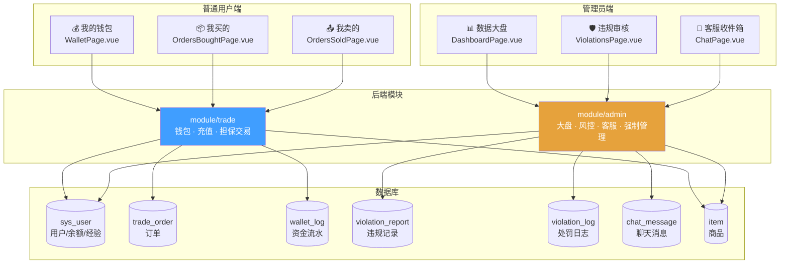

> 模块四横跨两条主线：**普通用户的钱包与交易**（`module/trade`）+ **管理员的后台控制台**（`module/admin`）。

---

## 二、虚拟钱包充值流程

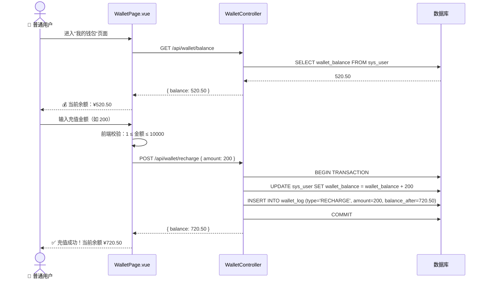

**关键规则：**

| 规则 | 说明 |
|------|------|
| 充值范围 | 单次 ≥ 0.01，≤ ¥10,000 |
| 幂等性 | 每次充值独立写入 `wallet_log` |
| 事务保证 | 余额更新 + 流水写入在同一事务中 |

---

## 三、担保交易核心流程 🔥

### 3.1 完整交易时序图

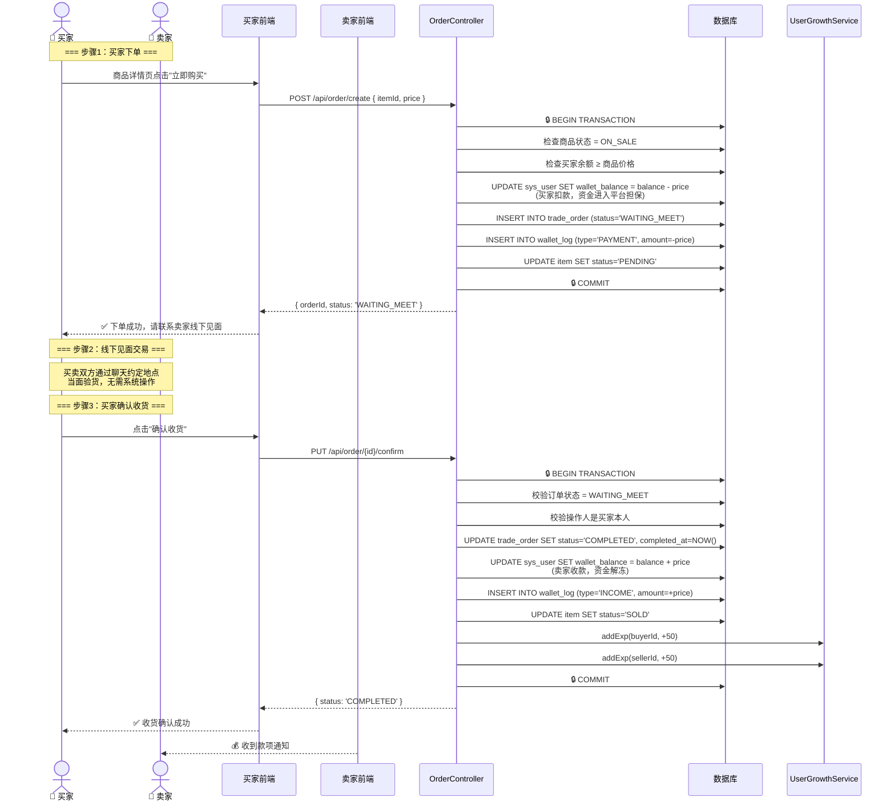

### 3.2 订单取消（退款）流程

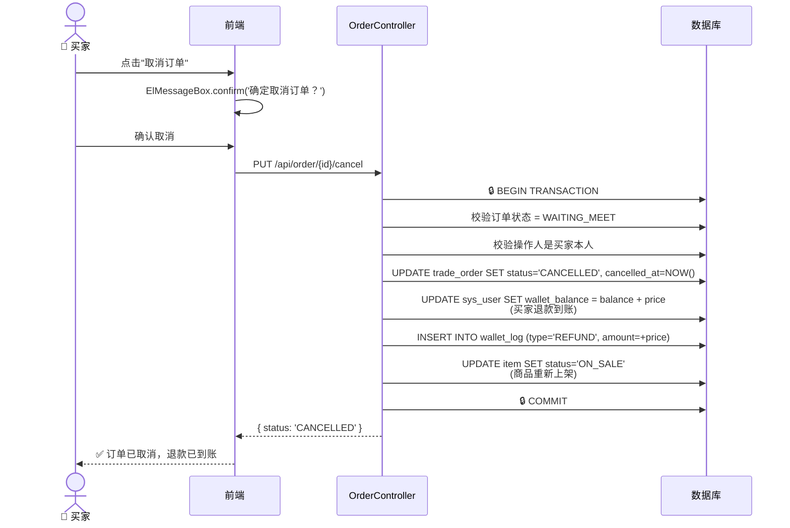

---

## 四、订单 & 商品状态机

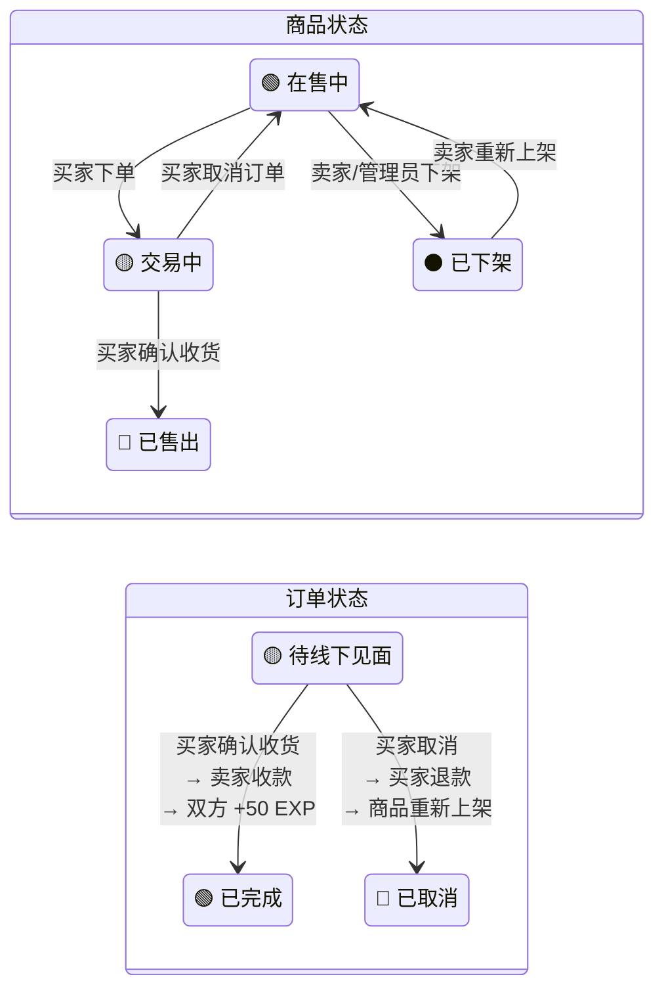

> **核心约束**：同一商品同一时间只能有一个活跃订单（状态为 `PENDING` 时他人不可再购买）。

---

## 五、管理员数据大盘

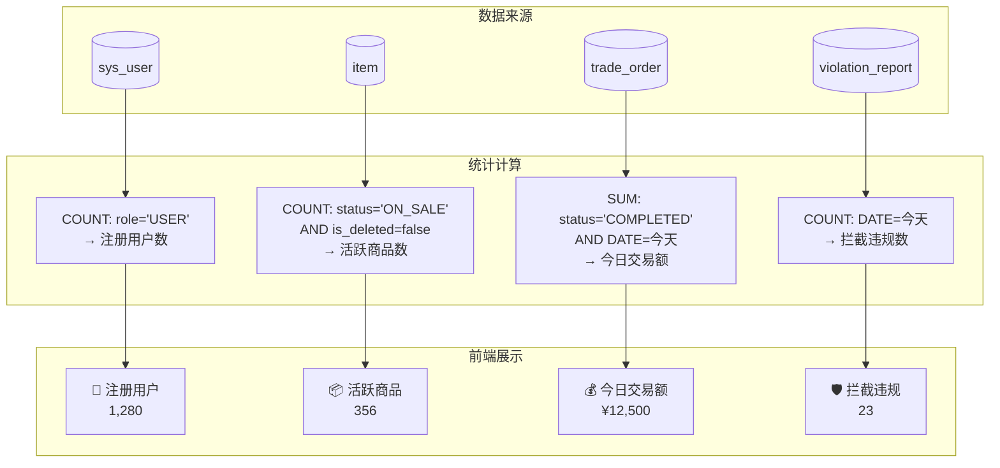

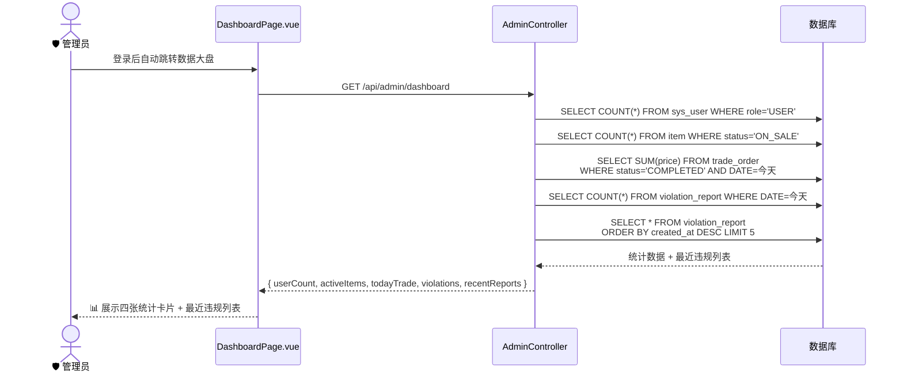

---

## 六、违规审核与处罚流程

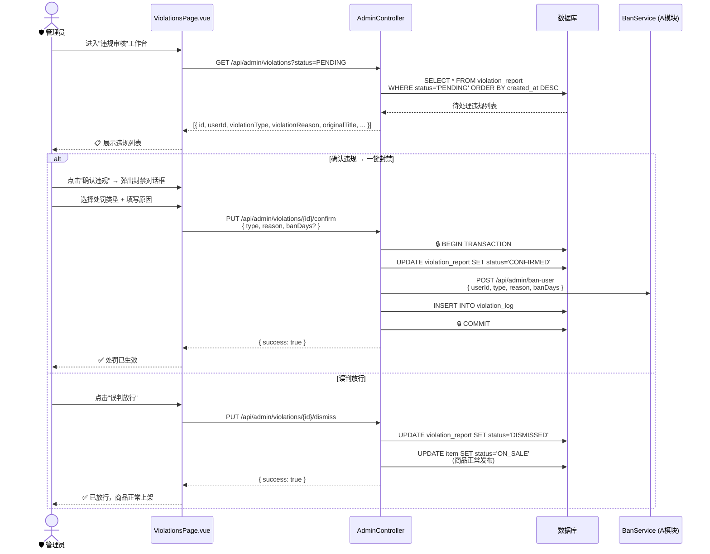

### 违规记录状态流转

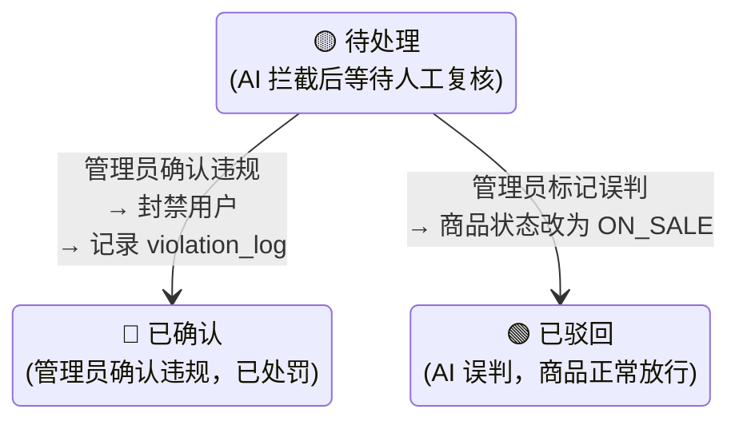

---

## 七、客服聊天流程

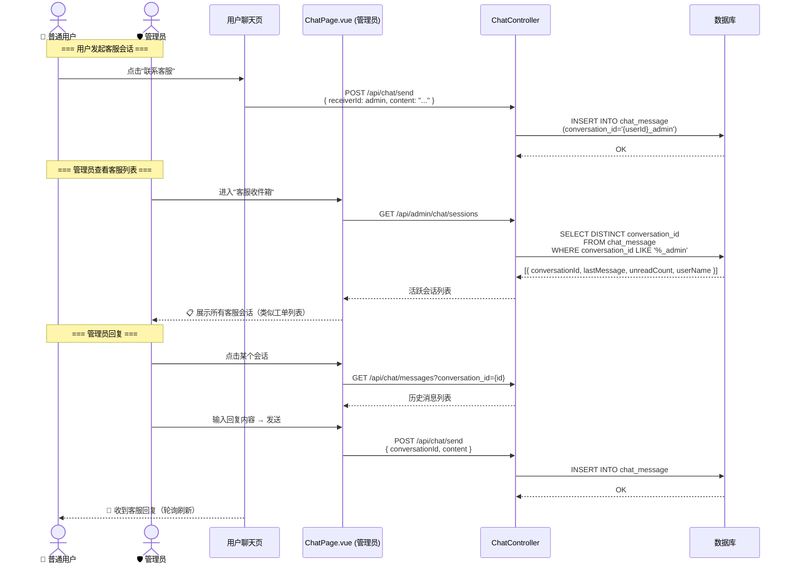

---

## 八、强制管理流程

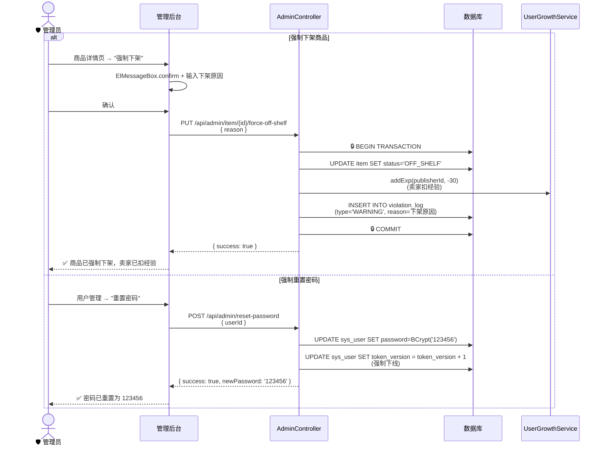

---

## 九、数据流汇总：模块四涉及的表

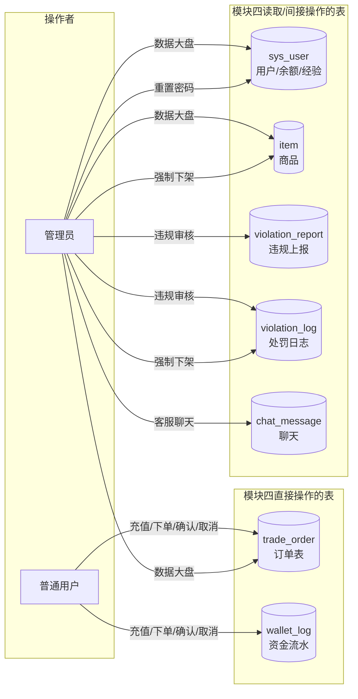

---

## 十、后端 Package 结构

```
backend/src/main/java/com/zhiyi/module/
├── trade/                          # 钱包与交易
│   ├── controller/
│   │   ├── WalletController.java   # 余额、充值、流水
│   │   └── OrderController.java    # 下单、确认、取消、订单列表
│   ├── entity/
│   │   ├── TradeOrder.java
│   │   └── WalletLog.java
│   ├── mapper/
│   │   ├── TradeOrderMapper.java
│   │   └── WalletLogMapper.java
│   └── service/
│       ├── WalletService.java
│       └── OrderService.java       # 🔥 @Transactional 担保交易核心
│
└── admin/                          # 超管控制台
    ├── controller/
    │   ├── AdminDashboardController.java   # 数据大盘
    │   ├── AdminViolationController.java   # 违规审核
    │   ├── AdminChatController.java        # 客服收件箱
    │   └── AdminManageController.java      # 强制下架、重置密码
    ├── entity/
    │   └── ViolationReport.java
    ├── mapper/
    │   └── ViolationReportMapper.java
    └── service/
        ├── AdminDashboardService.java
        ├── AdminViolationService.java
        └── AdminManageService.java
```

---

## 十一、前端页面与 API 对照

| 页面 | 调用的 API | 说明 |
|------|-----------|------|
| `wallet/WalletPage.vue` | `GET /api/wallet/balance`、`POST /api/wallet/recharge`、`GET /api/wallet/logs` | 钱包首页 |
| `wallet/OrdersBoughtPage.vue` | `GET /api/order/my-bought`、`PUT /api/order/{id}/confirm`、`PUT /api/order/{id}/cancel` | 我买的 |
| `wallet/OrdersSoldPage.vue` | `GET /api/order/my-sold` | 我卖的 |
| `admin/DashboardPage.vue` | `GET /api/admin/dashboard` | 数据大盘 |
| `admin/ViolationsPage.vue` | `GET /api/admin/violations`、`PUT .../{id}/confirm`、`PUT .../{id}/dismiss`、`POST /api/admin/ban-user` | 违规审核 |
| `admin/ChatPage.vue` | `GET /api/admin/chat/sessions`、`GET /api/chat/messages`、`POST /api/chat/send` | 客服收件箱 |

---

> 📝 **编写日期**：2026-07-11 | 基于《智易校园-功能需求规格说明书.md》v2.0 模块四编写
